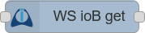
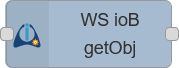
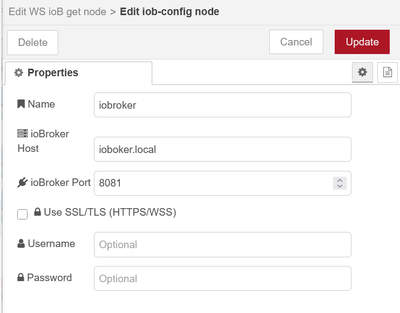
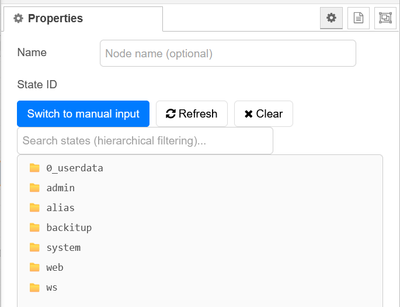

# Node-RED Nodes für ioBroker Integration

> **🌍 Sprachen / Languages:**
> [🇺🇸 English](README.md) | [🇩🇪 Deutsch](README.de.md)


Externe Node-RED Integrations-Nodes für ioBroker Kommunikation. KEIN ioBroker Adapter - eigenständiges Paket für externe Node-RED Instanzen zur Verbindung mit ioBroker über WebSocket.

## Inhaltsverzeichnis
- [Funktionen](#funktionen)
- [Anwendungsfälle](#anwendungsfälle)
- [Nodes](#nodes)
- [Installation](#installation)
- [Konfiguration und Authentifizierung](#konfiguration-und-authentifizierung)
- [Verwendung](#verwendung)
- [State-Auswahl](#state-auswahl)
- [Objekt-Management](#objekt-management)
- [Verbindungs-Management](#verbindungs-management)
- [Beispiele](#beispiele)
- [WebSocket-Verbindung](#websocket-verbindung)
- [Fehlerbehebung](#fehlerbehebung)
- [Lizenz](#lizenz)

## Wichtiger Hinweis

⚠️ Dieses Paket ist für **externe** Node-RED Installationen konzipiert. Es ermöglicht unabhängigen Node-RED Instanzen die Kommunikation mit ioBroker. Installieren Sie dieses Paket in Ihrer bestehenden Node-RED Umgebung, um eine Verbindung zu ioBroker herzustellen.

💡 Für eine einfachere Installation: In den meisten Fällen ist es einfacher, den ioBroker Node-RED Adapter zu verwenden, wenn Sie eine unkomplizierte Einrichtung bevorzugen.

🔧 **Bekanntes Problem - Token Ablauf**: Es gibt derzeit ein bekanntes Problem mit der Authentifizierung und ablaufenden Tokens, das zu Verbindungsabbrüchen führen kann. **Verwenden Sie KEINE Anmelde-Session-Dauern kürzer als 3600 Sekunden** (1 Stunde) in Ihren ioBroker Adapter-Einstellungen!

## Funktionen

- **Echtzeit-WebSocket-Kommunikation**
- **Geteiltes Verbindungsmanagement** - mehrere Nodes teilen sich WebSocket-Verbindungen
- **Interaktiver State-Browser** mit Suchfunktion
- **Wildcard-Pattern-Unterstützung** - Abonnierung mehrerer States mit Wildcards
- **Automatische Wiederverbindung** und Verbindungsstatus-Überwachung
- **Bidirektionale Kommunikation** für State-Änderungen und Befehle
- **Objekt-Management** für den Zugriff auf ioBroker Objektdefinitionen
- **Automatische Objekterstellung** - fehlende ioBroker Objekte automatisch erstellen
- **OAuth2-Authentifizierung** für Installationen mit Authentifizierung
- **No-Auth-Modus** ungesicherte Installationen ohne Authentifizierung

## Anwendungsfälle

- Externe Node-RED Instanzen, die mit ioBroker kommunizieren müssen
- Separate Automatisierungssysteme, die Node-RED unabhängig ausführen
- Verteilte Setups, bei denen Node-RED auf anderer Hardware als ioBroker läuft
- Entwicklungsumgebungen für Tests von Node-RED Flows gegen ioBroker
- Integrations-Szenarien, bei denen Node-RED als Brücke zwischen ioBroker und anderen Systemen dient

## Nodes

### WS ioB in  
**Input Node**  
Abonniert ioBroker State-Änderungen und leitet Updates in Echtzeit an Ihren Flow weiter. Unterstützt sowohl einzelne States als auch Wildcard-Pattern.

- **State:** Ein ioBroker State kann über den interaktiven Tree-Browser oder manuelle Eingabe festgelegt werden.
  - **Einzelne States:** `0_userdata.0.test`
  - **Wildcard-Pattern:** `system.adapter.*.alive` oder `0_userdata.0.*` (automatisch erkannt)
- **Output:** Der Wert des geänderten States wird als `msg.[outputProperty]` gesendet (Standard: `msg.payload`).  
  Das vollständige State-Objekt ist in `msg.state` verfügbar. Für Wildcard-Pattern enthält `msg.pattern` das ursprüngliche Pattern.
- **Trigger on:** Filterung von State-Updates nach Bestätigungsstatus:
  - **Both:** Alle Updates (Standard)
  - **Acknowledged:** Nur Updates mit `ack: true`
  - **Unacknowledged:** Nur Updates mit `ack: false`
- **Send initial value:** Wenn aktiviert, wird der aktuelle State-Wert sofort nach Verbindungsaufbau gesendet, gefolgt von regulären Änderungsbenachrichtigungen.
  - Der "Ack" - Filter gilt auch für Initial-Values!
  - **Hinweis:** Initial-Values werden automatisch für Wildcard-Pattern deaktiviert, um Performance-Probleme zu vermeiden
- **Server-Konfiguration:** Konfigurieren Sie die ioBroker Server-Details in den Node-Einstellungen.

### WS ioB out  
**Output Node**  
Sendet Werte an ioBroker States mit optionaler automatischer Objekterstellung.

- **State:** Legen Sie den Ziel-ioBroker State über den Tree-Browser oder manuelle Eingabe fest.  
  Wenn leer gelassen, wird `msg.topic` als State-ID verwendet.
- **Input:** Jede Nachricht mit einem Wert in `msg.[inputProperty]` (Standard: `msg.payload`) aktualisiert den festgelegten State.
- **Set Mode:** Wählen Sie, ob der Wert als `value` (ack=true) oder als `command` (ack=false) gesetzt werden soll.
- **Auto-Create Objects:** Wenn aktiviert, werden fehlende ioBroker Objekte automatisch vor dem Setzen von Werten erstellt.
  - **Statische Konfiguration:** Konfigurieren Sie Objekteigenschaften (Name, Rolle, Typ, Einheit, etc.) direkt in den Node-Einstellungen
  - **Dynamische Konfiguration:** Überschreiben von Eigenschaften mit Nachrichten-Attributen:
    - `msg.stateName` - Objektname/-beschreibung
    - `msg.stateRole` - Objektrolle (z.B. "state", "value", "sensor")
    - `msg.payloadType` - Datentyp ("boolean", "number", "string", "object", "array", "file", "mixed")
    - `msg.stateReadonly` - Nur-Lesen-Flag (true/false, Standard: beschreibbar)
    - `msg.stateUnit` - Maßeinheit (z.B. "°C", "%", "kWh")
    - `msg.stateMin` - Minimalwert
    - `msg.stateMax` - Maximalwert
  - **Auto-Erkennung:** Payload-Typ wird automatisch erkannt, wenn nicht festgelegt
  - **Objektstruktur:** Erstellt vollständige ioBroker Objektdefinitionen mit entsprechenden Metadaten
- **Server-Konfiguration:** Konfigurieren Sie die ioBroker Server-Daten in den Node-Einstellungen.

### WS ioB get 
**Getter Node**  
Liest den aktuellen Wert eines ioBroker States auf Anfrage.

- **State:** Legen Sie den Ziel-ioBroker State über den Tree-Browser oder manuelle Eingabe fest.  
  Wenn leer gelassen, wird `msg.topic` als State-ID verwendet.
- **Output:** Der aktuelle Wert des States wird als `msg.[outputProperty]` gesendet (Standard: `msg.payload`).
- **Server-Konfiguration:** Konfigurieren Sie die ioBroker Server-Details in den Node-Einstellungen.

### WS ioB getObject 
**Object Getter Node**  
Ruft ioBroker Objektdefinitionen ab, einschließlich Metadaten und Konfigurationsinformationen.

- **Object ID:** Legen Sie den Ziel-ioBroker State über den Tree-Browser oder manuelle Eingabe fest.  
  Wenn leer gelassen, wird `msg.topic` als State-ID verwendet.
- **Output:** Die vollständige Objektdefinition wird als `msg.[outputProperty]` gesendet (Standard: `msg.payload`).
- **Objektstruktur:** Gibt das vollständige ioBroker Objekt zurück, einschließlich Typ, allgemeine Eigenschaften, native Konfiguration und Zugriffskontrollinformationen.
- **Server-Konfiguration:** Konfigurieren Sie die ioBroker Server-Details in den Node-Einstellungen.

### iob-config



**Konfigurationsnode**  
Geteilte Konfiguration für ioBroker Server-Einstellungen.

- **ioBroker Host/Port:** Konfigurieren Sie den ioBroker WebSocket-Endpunkt.
- **Authentifizierung:** Benutzername/Passwort (optional) für gesicherte ioBroker Installationen.

## Installation

### Voraussetzungen
- **Node-RED** muss installiert und ausgeführt werden
- **ioBroker** System mit WebSocket-Fähigkeit (getrennt von Node-RED)
- Netzwerk-Konnektivität zwischen Ihrer Node-RED Instanz und ioBroker

### Methode 1: Installation über Node-RED Palette Manager
1. Öffnen Sie Ihren Node-RED Editor im Browser
2. Klicken Sie auf die Menü-Schaltfläche (☰) in der oberen rechten Ecke
3. Wählen Sie "Manage palette"
4. Wechseln Sie zum "Install" Tab
5. Suchen Sie nach `node-red-contrib-iobroker`
6. Klicken Sie "Install" neben dem Paket
7. Bestätigen Sie die Installation, wenn dazu aufgefordert wird
8. Die Nodes werden nach der Installation in der Palette verfügbar sein

### Methode 2: Installation von Release-Datei
1. Laden Sie die .tgz Datei vom [neuesten Release](https://github.com/Marc-Berg/node-red-contrib-iobroker/releases) auf GitHub herunter
2. Öffnen Sie Ihren Node-RED Editor im Browser
3. Klicken Sie auf die Menü-Schaltfläche (☰) und wählen Sie "Manage palette"
4. Wechseln Sie zum "Install" Tab
5. Klicken Sie "Upload a .tgz file" und wählen Sie die heruntergeladene .tgz Datei
6. Warten Sie, bis die Installation abgeschlossen ist und starten Sie Node-RED neu, wenn dazu aufgefordert wird

### Methode 3: Installation über npm Kommandozeile
```bash
npm install node-red-contrib-iobroker
```

Führen Sie diesen Befehl in Ihrem Node-RED Installationsverzeichnis aus oder verwenden Sie das Global-Flag:
```bash
npm install -g node-red-contrib-iobroker
```

**Hinweis:** Nach der Kommandozeilen-Installation müssen Sie möglicherweise Node-RED neu starten, um die neuen Nodes in der Palette zu sehen.

## Konfiguration und Authentifizierung

### Authentifizierungsmethoden

Die Nodes unterstützen zwei Authentifizierungsmethoden:

#### 1. Keine Authentifizierung (Standard)
Für ioBroker Installationen ohne Authentifizierungsanforderungen:
- Lassen Sie die **Benutzername** und **Passwort** Felder in der Konfigurationsnode leer
- Die Verbindung wird ohne Authentifizierung hergestellt
- Funktioniert mit Standard-ioBroker Installationen

#### 2. OAuth2-Authentifizierung
Für gesicherte ioBroker Installationen mit Benutzer-Authentifizierung:
- Geben Sie Ihren **Benutzername** und **Passwort** in der Konfigurationsnode ein
- Die Nodes handhaben automatisch OAuth2-Token-Anfragen
- Unterstützt automatische Token-Aktualisierung und Re-Authentifizierung
- Verwendet den Standard-ioBroker Authentifizierungs-Endpunkt (`/oauth/token`)

### Server-Konfiguration

1. **Erstellen Sie eine neue iob-config Node:**
   - **Name:** Geben Sie Ihrer Konfiguration einen beschreibenden Namen
   - **ioBroker Host:** Geben Sie den Hostnamen oder die IP-Adresse ein (z.B. `iobroker.local` oder `192.168.1.100`)
   - **ioBroker Port:** Geben Sie den WebSocket-Port ein (siehe [WebSocket-Verbindung](#websocket-verbindung) Abschnitt)
   - **Benutzername:** (Optional) Geben Sie den Benutzernamen für authentifizierte Verbindungen ein
   - **Passwort:** (Optional) Geben Sie das Passwort für authentifizierte Verbindungen ein

2. **Authentifizierungs-Setup:**
   - **Für No-Auth-Modus:** Lassen Sie Benutzername und Passwort leer
   - **Für OAuth2-Modus:** Geben Sie gültige ioBroker Anmeldedaten ein

### Authentifizierungs-Fehlerbehebung

#### Häufige Authentifizierungsprobleme:

1. **"Invalid username or password"**
   - Überprüfen Sie die Anmeldedaten in der ioBroker Admin-Oberfläche
   - Prüfen Sie, ob das Benutzerkonto aktiviert ist
   - Stellen Sie sicher, dass der Benutzer angemessene Berechtigungen hat

2. **"OAuth endpoint not found"**
   - Prüfen Sie, ob die Authentifizierung in ioBroker aktiviert ist
   - Überprüfen Sie, ob der korrekte Port verwendet wird

3. **"Access forbidden - check user permissions"**
   - Benutzerkonto existiert, aber hat keine erforderlichen Berechtigungen
   - Gewähren Sie angemessene Rechte in der ioBroker Benutzerverwaltung
   - Prüfen Sie, ob der Benutzer zu erforderlichen Gruppen gehört

#### Authentifizierungs-Status-Überwachung:

Senden Sie eine Nachricht mit `msg.topic = "status"` an jede Node, um detaillierte Verbindungsinformationen zu erhalten, einschließlich:
- Authentifizierungsstatus
- Verbindungszustand
- Server-Details
- Token-Gültigkeit (für OAuth2)

## Verwendung

1. **Ziehen und Ablegen** der Nodes in Ihren Flow.
2. **Konfigurieren** Sie die Server-Einstellungen in der `iob-config` Node:
   - Geben Sie die ioBroker Host- und Port-Details ein.
   - Fügen Sie Authentifizierungs-Anmeldedaten hinzu, falls erforderlich.
3. **Konfigurieren** Sie jede Node nach Bedarf:
   - Verwenden Sie den **interaktiven Tree-Browser** zur Auswahl von States oder Objekten, oder geben Sie sie manuell ein.
   - Für Wildcard-Pattern geben Sie einfach Pattern wie `system.adapter.*.alive` ein - der Wildcard-Modus wird automatisch erkannt.
   - Setzen Sie die Output/Input-Eigenschaft für den Wert (Standard: `msg.payload`).
   - Für `iobin` wählen Sie, ob bei allen Updates oder nur bei bestätigten/unbestätigten Änderungen ausgelöst werden soll.
   - Für `iobin` aktivieren Sie optional **"Send initial value on startup"**, um den aktuellen State-Wert sofort nach (Wieder-)Verbindung zu erhalten.
   - Für `iobout` wählen Sie zwischen "value" (ack=true) oder "command" (ack=false) Modus.
   - Für `iobout` aktivieren Sie optional **"Auto create objects"**, um fehlende ioBroker Objekte automatisch zu erstellen.
   - Für `iobget` und `iobgetobject` setzen Sie die State- oder Objekt-ID oder lassen Sie sie leer, um `msg.topic` zu verwenden.
4. **Verbinden** Sie die Nodes nach Bedarf mit Ihrem Flow.

## State-Auswahl



Alle Nodes verfügen über einen **interaktiven State-Browser**, der es einfach macht, ioBroker States zu finden und auszuwählen:

- **Manuelle Eingabe:** Geben Sie die State-ID direkt ein (z.B. `0_userdata.0.test`) oder Wildcard-Pattern (z.B. `system.adapter.*.alive`)
- **Tree-Browser:** Klicken Sie "Switch to tree selection", um verfügbare States zu durchsuchen
- **Suchfunktion:** Verwenden Sie die Suchbox, um States in der Tree-Ansicht zu filtern
- **Smart Caching:** State-Listen werden für bessere Performance zwischengespeichert
- **Echtzeit-Aktualisierung:** Aktualisieren Sie die State-Liste mit der Refresh-Schaltfläche
- **Wildcard-Unterstützung:** Pattern mit `*` werden automatisch erkannt und validiert

### Wildcard-Pattern

Wildcard-Pattern ermöglichen das Abonnieren mehrerer States gleichzeitig:

- **Unterstützte Wildcards:** Nur `*` wird von ioBroker unterstützt (nicht `?`)
- **Beispiele:**
  - `system.adapter.*.alive` - alle Adapter-Alive-States
  - `0_userdata.0.*` - alle States unter 0_userdata.0
  - `*.temperature` - alle Temperatur-States
- **Auto-Erkennung:** Wildcard-Modus wird automatisch aktiviert, wenn `*` im Pattern erkannt wird
- **Performance:** Vermeiden Sie zu weitreichende Pattern wie `*` oder `*.*`

## Objekt-Management

Die `iobgetobject` Node bietet Zugriff auf ioBroker Objektdefinitionen, die die strukturellen und Konfigurationsinformationen für alle ioBroker Objekte enthalten. Objektdefinitionen umfassen wesentliche Metadaten wie Objekttyp-Klassifizierung (State, Channel, Device, Adapter), allgemeine Eigenschaften einschließlich Namen und Rollen, Adapter-spezifische native Konfigurationen und Zugriffskontroll-Einstellungen.

Die `iobout` Node kann automatisch fehlende Objekte erstellen, wenn die **Auto-Create Objects** Funktion aktiviert ist. Dies ermöglicht es Node-RED Flows, dynamisch neue ioBroker States zu erstellen, ohne manuelle Konfiguration in der ioBroker Admin-Oberfläche.

### Objekt-Auto-Erstellungs-Prozess

1. **Existenz prüfen:** Die Node prüft zuerst, ob das Zielobjekt bereits existiert
2. **Erstellen falls fehlend:** Wenn das Objekt nicht existiert und Auto-Create aktiviert ist:
   - Erstellt eine vollständige ioBroker Objektdefinition
   - Setzt Metadaten (Name, Rolle, Typ, Lese-/Schreibberechtigungen)
   - Wendet konfigurierte oder erkannte Eigenschaften an (Einheit, Min-/Max-Werte, etc.)
3. **Wert setzen:** Fährt fort mit dem normalen Setzen des State-Werts

### Objekt-Konfigurationsmethoden

- **Statische Konfiguration:** Setzen Sie Objekteigenschaften direkt in der Node-Konfiguration
- **Dynamische Konfiguration:** Überschreiben Sie Eigenschaften über Nachrichten-Eigenschaften (`msg.stateName`, `msg.stateRole`, etc.)
- **Auto-Erkennung:** Automatische Erkennung von Datentypen aus Payload-Werten
- **Intelligente Standards:** Verwendung sinnvoller Standards für fehlende Eigenschaften

## Verbindungs-Management

### Geteilte Verbindungen
Mehrere Nodes können die gleiche ioBroker Verbindung für effiziente Ressourcennutzung teilen:
- **Automatisches Teilen:** Nodes mit identischen Server-Konfigurationen teilen Verbindungen
- **Unabhängige Abonnements:** Jede Node behält ihre eigenen State-Abonnements
- **Effiziente Wiederverbindung:** Verbindungsausfälle betreffen alle Nodes, verbinden sich aber wieder automatisch

### Status-Überwachung
Überwachen Sie die Verbindungsdaten, indem Sie Status-Anfragen an jede Node senden (außer iobin):
```javascript
msg.topic = "status"
```

Antwort enthält:
- Verbindungsstatus und Server-Details
- Authentifizierungsinformationen und Token-Status
- Verbindungshistorie (Verbinden/Trennen-Zähler, Zeitstempel)

## WebSocket-Verbindung

Die Nodes verbinden sich mit ioBrokers WebSocket-Schnittstelle über **eine** von drei Optionen:

### Ports:

1. **WebSocket-Adapter** (Standard-Port 8084)
   - Dedizierter WebSocket-Adapter

2. **Web-Adapter** (Standard-Port 8082)
   - Erfordert aktiviertes "Use pure web-sockets (iobroker.ws)"

3. **Admin-Adapter** (Standard-Port 8081)
   - Verwendet die Admin-Oberflächen-WebSocket
   - Normalerweise bereits mit ioBroker vorinstalliert

## Fehlerbehebung

### Verbindungsprobleme:

1. **WebSocket-Adapter prüfen:** 
   - **WebSocket-Adapter (8084):** Stellen Sie sicher, dass er installiert und ausgeführt wird
   - **Web-Adapter (8082):** Stellen Sie sicher, dass er installiert und ausgeführt wird
   - **Admin-Adapter (8081):** Stellen Sie sicher, dass er installiert und ausgeführt wird

2. **Netzwerk-Konnektivität überprüfen:** Testen Sie, ob der gewählte Port von Node-RED aus erreichbar ist

3. **Authentifizierungs-Konfiguration prüfen:**
   - Überprüfen Sie Benutzername/Passwort, wenn Authentifizierung in ioBroker aktiviert ist
   - Stellen Sie sicher, dass der Benutzer angemessene Berechtigungen hat
   - Prüfen Sie, ob der OAuth2-Endpunkt zugänglich ist

4. **Logs überprüfen:** Prüfen Sie sowohl Node-RED Debug-Logs als auch ioBroker Logs auf Fehlermeldungen

5. **Status-Überwachung verwenden:** Senden Sie Status-Nachrichten an Nodes, um die Verbindungsgesundheit zu prüfen

6. **Alternative Ports versuchen:** Wenn ein Port nicht funktioniert, versuchen Sie die anderen WebSocket-Optionen

### Authentifizierungsprobleme:

1. **"Connection refused"**
   - Prüfen Sie, ob ioBroker läuft
   - Überprüfen Sie die korrekte Port-Nummer
   - Prüfen Sie Firewall-Einstellungen

2. **"Authentication failed"**
   - Überprüfen Sie Benutzername und Passwort
   - Prüfen Sie Benutzer-Berechtigungen in ioBroker
   - Stellen Sie sicher, dass Authentifizierung im Adapter aktiviert ist

3. **"Token expired"**
   - Authentifizierungs-Token werden automatisch aktualisiert
   - Prüfen Sie, ob das Benutzerkonto noch aktiv ist
   - Überprüfen Sie die Systemzeit-Synchronisation

4. **"No OAuth endpoint"**
   - Authentifizierung ist möglicherweise nicht aktiviert
   - Versuchen Sie den No-Auth-Modus
   - Prüfen Sie die Adapter-Konfiguration

### Objekterstellungs-Probleme:

1. **"Object creation failed"**
   - Prüfen Sie, ob der Benutzer Objekterstellungs-Berechtigungen in ioBroker hat
   - Überprüfen Sie, ob das State-ID-Format gültig ist
   - Stellen Sie sicher, dass das ioBroker System ausreichende Ressourcen hat

2. **"Invalid object properties"**
   - Prüfen Sie konfigurierte Objekteigenschaften (Typ, Rolle, etc.)
   - Überprüfen Sie, ob Min-/Max-Werte gültige Zahlen sind
   - Stellen Sie sicher, dass Einheiten-Strings richtig formatiert sind

### Mehrfach-Server-Unterstützung:

Die Nodes unterstützen Verbindungen zu mehreren ioBroker Servern:
- Erstellen Sie separate Konfigurationsnodes für jeden Server
- Jeder Server kann verschiedene Authentifizierungsmethoden verwenden
- Verbindungen werden unabhängig mit automatischem Failover verwaltet

## Lizenz

MIT
