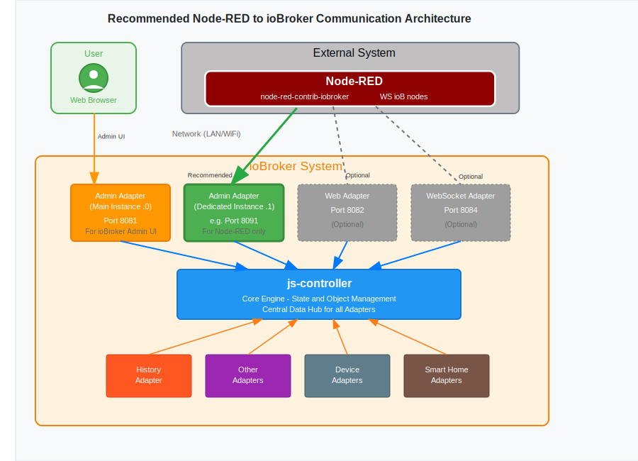

# Node-RED Nodes für ioBroker Integration

> **🌍 Sprachen:** [🇺🇸 English](https://github.com/Marc-Berg/node-red-contrib-iobroker/blob/main/README.md) | [🇩🇪 Deutsch](#)

Externe Node-RED Integrations-Nodes für die ioBroker Kommunikation. **KEIN ioBroker Adapter** - eigenständiges Paket für externe Node-RED Instanzen zur Verbindung mit ioBroker über WebSocket.

## 🤔 Welche Lösung ist für Sie richtig?

### 📊 Entscheidungshilfe: ioBroker Node-RED Adapter vs. diese Nodes

| **Szenario** | **ioBroker Node-RED Adapter verwenden** | **Diese externen Nodes verwenden** |
|:-------------|:----------------------------------------:|:----------------------------------:|
| **🏠 Einfache Heiminstallation** | ✅ **Empfohlen** | ❌ Überdimensioniert |
| **🏭 Installation auf Appliances/PLCs** | ❌ Nicht möglich | ✅ **Empfohlen** |
| **⚡ Hohe Performance-Anforderungen** | ❓ Geteilte Ressourcen | ⚠️ **Könnte vorteilhaft sein** |
| **🔄 Node-RED Updates/Wartung** | ❓ An ioBroker gekoppelt | ✅ **Empfohlen** |
| **📊 Erweiterte Funktionen** | ❓ Begrenzt | ✅ **Empfohlen** |

### 🎯 **ioBroker Node-RED Adapter wählen wenn:**
- **Einfache Hausautomatisierung** mit Grundanforderungen ausreicht
- **Ein-Klick-Installation** Priorität hat
- **Minimaler Konfigurationsaufwand** gewünscht ist
- **Geteiltes Hosting** akzeptabel ist

### 🚀 **Diese externen Nodes wählen für:**
- **Appliances und PLCs** (Wago, Beckhoff, etc.) mit Node-RED
- **Hochperformante** Anwendungen (könnten von dedizierten Ressourcen profitieren)
- **Spezialisierte Funktionen** wie Verlaufsdaten, Logs
- **Neueste Node-RED Versionen** (ohne Adapter-Abhängigkeit)
- **Vollständige Node-RED Konfiguration** (alle Einstellungen & Module)
- **Dedizierte Ressourcen** und potentiell bessere Fehlerisolation

## 🚀 Schnellstart

### Installation
Installiere die Nodes über den Node-RED Palette Manager:
1. Node-RED Oberfläche öffnen
2. Hamburger-Menü (drei Striche) → Palette verwalten
3. Zum "Installieren" Tab wechseln
4. Nach "node-red-contrib-iobroker" suchen
5. "Installieren" Button klicken

### Grundeinrichtung
1. **Dedizierte Admin Adapter Instanz erstellen** (empfohlen):
   - Zweite Admin Adapter Instanz in ioBroker installieren
   - Auf anderem Port konfigurieren (z.B. 8091)
   - Ausschließlich für Node-RED Verbindungen verwenden
2. **iob-config Node konfigurieren** mit deiner dedizierten Instanz:
   - Host: Hostname oder IP-Adresse
   - Port: 8091 (deine dedizierte Admin Instanz)
   - Authentifizierung: Optional Benutzername/Passwort
3. **Nodes in deinen Flows verwenden**

## 🏗️ Architektur Übersicht

Das Diagramm zeigt die empfohlene Architektur mit einer dedizierten Admin Adapter Instanz für Node-RED Verbindungen, getrennt von der Admin Oberfläche für normale Benutzer.

## 📦 Verfügbare Nodes

| Node | Zweck | Anwendungsbeispiel | Dokumentation |
|------|-------|-------------------|---------------|
| **WS ioB in** | State-Änderungen abonnieren | Temperatursensoren überwachen | [📖 Details](docs/nodes/iob-in.md) |
| **WS ioB out** | Werte an States senden mit Auto-Erstellung | Lichter, Schalter steuern | [📖 Details](docs/nodes/iob-out.md) |
| **WS ioB get** | Aktuelle State-Werte lesen | Sensormesswerte bei Bedarf abrufen | [📖 Details](docs/nodes/iob-get.md) |
| **WS ioB getObj** | Objektdefinitionen abrufen | Geräte-Metadaten zugreifen | [📖 Details](docs/nodes/iob-getobject.md) |
| **WS ioB setObj** | Objektdefinitionen schreiben/ändern | Instanz-Einstellungen aktualisieren, Objekteigenschaften ändern | [📖 Details](docs/nodes/iob-setobject.md) |
| **WS ioB inObj** | Objektänderungen überwachen | Adapter-Installationen verfolgen | [📖 Details](docs/nodes/iob-inobj.md) |
| **WS ioB history** | Auf historische Daten zugreifen | Energieverbrauchsanalyse | [📖 Details](docs/nodes/iob-history.md) |
| **WS ioB log** | Live-Log Überwachung | Systemzustand überwachen | [📖 Details](docs/nodes/iob-log.md) |
| **WS ioB sendTo** | Befehle an ioBroker Adapter senden | Telegram-Benachrichtigungen, Datenbankabfragen | [📖 Details](docs/nodes/iob-sendto.md) |

## 🔧 Konfiguration

### Empfohlene Einrichtung: Dedizierte Admin Instanz

**Warum eine dedizierte Admin Instanz verwenden?**
- Isoliert Node-RED Traffic von der Haupt-Admin Oberfläche
- Verhindert Konflikte mit normaler Admin-Nutzung
- Vermeidet doppelte Events, wenn das Admin-Interface im Browser geöffnet ist
- Ermöglicht benutzerdefinierte Sicherheitseinstellungen

**Einrichtungsschritte:**
1. **Zweite Admin Adapter Instanz installieren** in ioBroker:
   - Gehe zu Adapter → Admin → Instanz hinzufügen
   - Benutzerdefinierten Port konfigurieren (z.B. 8091)
   - Features nach Bedarf aktivieren/deaktivieren
2. **Sicherheit für Node-RED Zugriff konfigurieren**:
   - Dedizierten Benutzer für Node-RED erstellen
   - Angemessene Berechtigungen setzen

### Server Konfiguration (iob-config)

**Verbindungseinstellungen:**
- **Name**: Beschreibender Name für deine ioBroker Instanz
- **Host**: IP-Adresse (z.B. 192.168.1.100) oder Hostname (z.B. iobroker.local)
- **Port**: Dein dedizierter Admin Instanz Port (z.B. 8091)
- **SSL verwenden**: Für HTTPS/WSS Verbindungen aktivieren
- **Standardprofil**: Wenn mehrere Profile vorhanden sind, kann eines für die automatische Auswahl im Editor markiert werden

**Authentifizierungseinstellungen:**
- **Keine Authentifizierung** (Standard): Benutzername/Passwort leer lassen
- **OAuth2**: Gültigen ioBroker Benutzername/Passwort eingeben

Wenn nur ein iob-config Profil vorhanden ist, wird es automatisch ausgewählt. Wenn mehrere Profile vorhanden sind, wird nur das als Standard markierte Profil automatisch ausgewählt.

### Alternative Adapter Optionen

Falls du keine Admin Instanz verwenden möchtest:

- **WebSocket Adapter** (Port 8084) - WebSocket Adapter für externe Verbindungen
- **Web Adapter** (Port 8082) - Erfordert aktivierte "Reine Web-Sockets verwenden" Option

**⚠️ Wichtige Einschränkungen bei alternativen Adaptern:**
- **WS ioB log Node funktioniert nicht** mit WebSocket oder Web Adapter (erfordert Admin Adapter)

## 📚 Zusätzliche Ressourcen

- **📋 Release Notes**: [Changelog](https://github.com/Marc-Berg/node-red-contrib-iobroker/blob/main/CHANGELOG.md)
- **🔍 Fehlerbehebung**: [Troubleshooting Guide](https://github.com/Marc-Berg/node-red-contrib-iobroker/blob/main/docs/troubleshooting.md)
- **📊 Logging**: [Logging Guide](https://github.com/Marc-Berg/node-red-contrib-iobroker/blob/main/docs/logging.md) - Log-Nachrichten verstehen und Fehlerdiagnose
- **🎯 Anwendungsfälle**: [Common Use Cases](https://github.com/Marc-Berg/node-red-contrib-iobroker/blob/main/docs/use-cases.md)
- **📖 Vollständige Dokumentation**: [GitHub Repository](https://github.com/Marc-Berg/node-red-contrib-iobroker)
- **🐛 Fehlerberichte**: [GitHub Issues](https://github.com/Marc-Berg/node-red-contrib-iobroker/issues)
- **📘 ioBroker Forum**: [ioBroker.net](https://forum.iobroker.net)

## 📄 Lizenz

MIT

---
