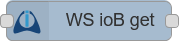
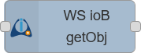
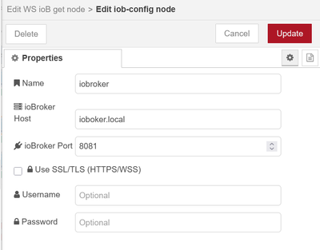

# Node-RED Nodes for ioBroker Integration


External Node-RED integration nodes for ioBroker communication. NOT an ioBroker adapter - standalone package for external Node-RED instances to connect with ioBroker via WebSocket.

## Table of Contents
- [Features](#features)
- [Use Cases](#use-cases)
- [Nodes](#nodes)
- [Installation](#installation)
- [Configuration and Authentication](#configuration-and-authentication)
- [Usage](#usage)
- [State Selection](#state-selection)
- [Object Management](#object-management)
- [Connection Management](#connection-management)
- [Examples](#examples)
- [WebSocket Connection](#websocket-connection)
- [Troubleshooting](#troubleshooting)
- [License](#license)

## Important Notice

⚠️ This package is designed for **external** Node-RED installations. It allows independent Node-RED instances to communicate with ioBroker. Install this package in your existing Node-RED setup to connect to ioBroker.

💡 For simpler installation: In most cases, it's easier to use the ioBroker Node-RED adapter if you prefer a straightforward setup.

🔧 **Known Issue - Authentication Token Expiry**: There is currently a known issue with authentication and expiring tokens that can cause connection drops. **Do not use login session durations shorter than 3600 seconds** (1 hour) in your ioBroker adapter settings!

## Features

- **Real-time WebSocket communication**
- **Shared connection management** - multiple nodes share WebSocket connections
- **Interactive state browser** with search functionality
- **Wildcard pattern support** - subscribe to multiple states with pattern matching
- **Automatic reconnection** and connection status monitoring
- **Bidirectional communication** for state changes and commands
- **Object management** for accessing ioBroker object definitions
- **OAuth2 authentication support** for secured installations
- **No-auth mode** for unsecured installations
  
## Use Cases

- External Node-RED instances that need to communicate with ioBroker
- Separate automation systems running Node-RED independently
- Distributed setups where Node-RED runs on different hardware than ioBroker
- Development environments where you want to test Node-RED flows against ioBroker
- Integration scenarios where Node-RED serves as a bridge between ioBroker and other systems

## Nodes

### WS ioB in  
**Input Node**  
Subscribes to ioBroker state changes and forwards updates to your flow in real-time. Supports both single states and wildcard patterns.

- **State:** An ioBroker state can be specified using the interactive tree browser or manual input. 
  - **Single states:** `0_userdata.0.test`
  - **Wildcard patterns:** `system.adapter.*.alive` or `0_userdata.0.*` (automatically detected)
- **Output:** The value of the changed state is sent as `msg.[outputProperty]` (default: `msg.payload`).  
  The complete state object is available in `msg.state`. For wildcard patterns, `msg.pattern` contains the original pattern.
- **Trigger on:** Filter state updates by acknowledgment status:
  - **Both:** All updates (default)
  - **Acknowledged:** Only updates with `ack: true`
  - **Unacknowledged:** Only updates with `ack: false`
- **Send initial value:** When enabled, the current state value is sent immediately after connection establishment, followed by regular change notifications.
  - Initial value messages contain an additional `msg.initial = true` property for identification
  - The same acknowledgment filter applies to initial values
  - **Note:** Initial values are automatically disabled for wildcard patterns to prevent performance issues
- **Server Configuration:** Configure the ioBroker server details in the node settings.

### WS ioB out  
**Output Node**  
Sends values to ioBroker states.

- **State:** Specify the target ioBroker state using the tree browser or manual input.  
  If left empty, `msg.topic` is used as the state ID.
- **Input:** Any message with a value in `msg.[inputProperty]` (default: `msg.payload`) will update the specified state.
- **Set Mode:** Choose whether to set the value as a `value` (ack=true) or as a `command` (ack=false).
- **Server Configuration:** Configure the ioBroker server details in the node settings.

### WS ioB get 
**Getter Node**  
Reads the current value of an ioBroker state on demand.

- **State:** Specify the ioBroker state to read using the tree browser or manual input.  
  If left empty, `msg.topic` is used as state ID.
- **Output:** The current value of the state is sent as `msg.[outputProperty]` (default: `msg.payload`).
- **Server Configuration:** Configure the ioBroker server details in the node settings.

### WS ioB getObject 
**Object Getter Node**  
Retrieves ioBroker object definitions, including metadata and configuration information.

- **Object ID:** Specify the ioBroker object identifier using the tree browser or manual input.  
  If left empty, `msg.topic` is used as object ID.
- **Output:** The complete object definition is sent as `msg.[outputProperty]` (default: `msg.payload`).
- **Object Structure:** Returns the full ioBroker object including type, common properties, native configuration, and access control information.
- **Server Configuration:** Configure the ioBroker server details in the node settings.

### iob-config



**Configuration Node**  
Shared configuration for ioBroker server settings.

- **ioBroker Host/Port:** Configure the ioBroker WebSocket endpoint.
- **Authentication:** Optional username/password for secured ioBroker installations.

## Installation

### Prerequisites
- **Node-RED** must be installed and running
- **ioBroker** system with WebSocket capability (separate from Node-RED)
- Network connectivity between your Node-RED instance and ioBroker

### Method 1: Install from Node-RED Palette Manager
1. Open your Node-RED editor in the browser
2. Click the menu button (☰) in the top right corner
3. Select "Manage palette"
4. Switch to the "Install" tab
5. Search for `node-red-contrib-iobroker`
6. Click "Install" next to the package
7. Confirm the installation when prompted
8. The nodes will be available in the palette after installation

### Method 2: Install from Release File
1. Download the .tgz file from the [latest release](https://github.com/Marc-Berg/node-red-contrib-iobroker/releases) on GitHub
2. Open your Node-RED editor in the browser
3. Click the menu button (☰) and select "Manage palette"
4. Switch to the "Install" tab
5. Click "Upload a .tgz file" and select the downloaded .tgz file
6. Wait for the installation to complete and restart Node-RED if prompted

### Method 3: Install from npm Command Line
```bash
npm install node-red-contrib-iobroker
```

Run this command in your Node-RED installation directory or use the global flag:
```bash
npm install -g node-red-contrib-iobroker
```

**Note:** After command line installation, you may need to restart Node-RED to see the new nodes in the palette.

## Configuration and Authentication

### Authentication Methods

The nodes support two authentication methods:

#### 1. No Authentication (Default)
For ioBroker installations without authentication requirements:
- Leave **Username** and **Password** fields empty in the configuration node
- The connection will be established without authentication
- Works with default ioBroker installations

#### 2. OAuth2 Authentication
For secured ioBroker installations with user authentication:
- Enter your **Username** and **Password** in the configuration node
- The nodes will automatically handle OAuth2 token requests
- Supports automatic token refresh and re-authentication
- Uses the standard ioBroker authentication endpoint (`/oauth/token`)

### Server Configuration

1. **Create a new iob-config node:**
   - **Name:** Give your configuration a descriptive name
   - **ioBroker Host:** Enter the hostname or IP address (e.g., `iobroker.local` or `192.168.1.100`)
   - **ioBroker Port:** Enter the WebSocket port (see [WebSocket Connection](#websocket-connection) section)
   - **Username:** (Optional) Enter username for authenticated connections
   - **Password:** (Optional) Enter password for authenticated connections

2. **Authentication Setup:**
   - **For no-auth mode:** Leave username and password empty
   - **For OAuth2 mode:** Enter valid ioBroker credentials

### Authentication Troubleshooting

#### Common Authentication Issues:

1. **"Invalid username or password"**
   - Verify credentials in ioBroker admin interface
   - Check if the user account is enabled
   - Ensure the user has appropriate permissions

2. **"OAuth endpoint not found"**
   - Check if authentication is enabled in ioBroker
   - Verify the correct port is being used

3. **"Access forbidden - check user permissions"**
   - User account exists but lacks necessary permissions
   - Grant appropriate rights in ioBroker user management
   - Check if user belongs to required groups

#### Authentication Status Monitoring:

Send a message with `msg.topic = "status"` to any node to get detailed connection information including:
- Authentication status
- Connection state
- Server details
- Token validity (for OAuth2)

## Usage

1. **Drag and drop** the nodes into your flow.
2. **Configure** the server settings in the `iob-config` node:
   - Enter the ioBroker host and port details.
   - Add authentication credentials if required.
3. **Configure** each node as needed:
   - Use the **interactive tree browser** to select states or objects, or enter them manually.
   - For wildcard patterns, simply enter patterns like `system.adapter.*.alive` - wildcard mode is detected automatically.
   - Set the output/input property for the value (default: `msg.payload`).
   - For `iobin`, select whether to trigger on all updates or only on acknowledged/unacknowledged changes.
   - For `iobin`, optionally enable **"Send initial value on startup"** to receive the current state value immediately after (re)connection.
   - For `iobout`, choose between "value" (ack=true) or "command" (ack=false) mode.
   - For `iobget` and `iobgetobject`, set the state or object ID or leave empty to use `msg.topic`.
4. **Connect** the nodes to your flow as needed.

## State Selection


All nodes feature an **interactive state browser** that makes it easy to find and select ioBroker states:

- **Manual input:** Type the state ID directly (e.g., `0_userdata.0.test`) or wildcard patterns (e.g., `system.adapter.*.alive`)
- **Tree browser:** Click "Switch to tree selection" to browse available states
- **Search functionality:** Use the search box to filter states in tree view
- **Smart caching:** State lists are cached for better performance
- **Real-time refresh:** Update the state list with the refresh button
- **Wildcard support:** Patterns using `*` are automatically detected and validated

### Wildcard Patterns

Wildcard patterns allow subscribing to multiple states at once:

- **Supported wildcards:** Only `*` is supported by ioBroker (not `?`)
- **Examples:**
  - `system.adapter.*.alive` - all adapter alive states
  - `0_userdata.0.*` - all states under 0_userdata.0
  - `*.temperature` - all temperature states
- **Auto-detection:** Wildcard mode is automatically enabled when `*` is detected in the pattern
- **Performance:** Avoid overly broad patterns like `*` or `*.*`

## Object Management

The `iobgetobject` node provides access to ioBroker object definitions, which contain the structural and configuration information for all ioBroker entities. Object definitions include essential metadata such as object type classification (state, channel, device, adapter), common properties including names and roles, adapter-specific native configurations, and access control settings.

## Connection Management

### Shared Connections
Multiple nodes can share the same ioBroker connection for efficient resource usage:
- **Automatic sharing:** Nodes with identical server configurations share connections
- **Independent subscriptions:** Each node maintains its own state subscriptions
- **Efficient reconnection:** Connection failures affect all sharing nodes but recover automatically

### Status Monitoring
Monitor connection health by sending status requests to any node (except iobin):
```javascript
msg.topic = "status"
```

Response includes:
- Connection status and server details
- Authentication information and token status
- Connection history (connect/disconnect counts, timestamps)
- Node-specific information (initial value status)

## WebSocket Connection

The nodes connect to ioBroker's WebSocket interface via **one** of three options:

### Port Options:

1. **WebSocket adapter** (default port 8084)
   - Dedicated WebSocket adapter

2. **Web adapter** (default port 8082)
   - Requires "Use pure web-sockets (iobroker.ws)" to be enabled

3. **Admin adapter** (default port 8081)
   - Uses the admin interface WebSocket
   - Usually pre-installed with ioBroker

## Troubleshooting

### Connection Issues:

1. **Check WebSocket adapters:** 
   - **WebSocket adapter (8084):** Ensure it's installed and running
   - **Web adapter (8082):** Ensure it's installed and running
   - **Admin adapter (8081):** Ensure it's installed and running

2. **Verify network connectivity:** Test if the chosen port is reachable from Node-RED

3. **Check authentication configuration:**
   - Verify username/password if authentication is enabled in ioBroker
   - Ensure user has appropriate permissions
   - Check if OAuth2 endpoint is accessible

4. **Review logs:** Check both Node-RED debug logs and ioBroker logs for error messages

5. **Use status monitoring:** Send status messages to nodes to check connection health

6. **Try alternative ports:** If one port doesn't work, try the other WebSocket options

### Authentication Issues:

1. **"Connection refused"**
   - Check if ioBroker is running
   - Verify the correct port number
   - Check firewall settings

2. **"Authentication failed"**
   - Verify username and password
   - Check user permissions in ioBroker
   - Ensure authentication is enabled in the adapter

3. **"Token expired"**
   - Authentication tokens are automatically refreshed
   - Check if user account is still active
   - Verify system time synchronization

4. **"No OAuth endpoint"**
   - Authentication may not be enabled
   - Try using no-auth mode
   - Check adapter configuration

### Multiple Server Support:

The nodes support connections to multiple ioBroker servers:
- Create separate configuration nodes for each server
- Each server can use different authentication methods
- Connections are managed independently with automatic failover

## License

MIT