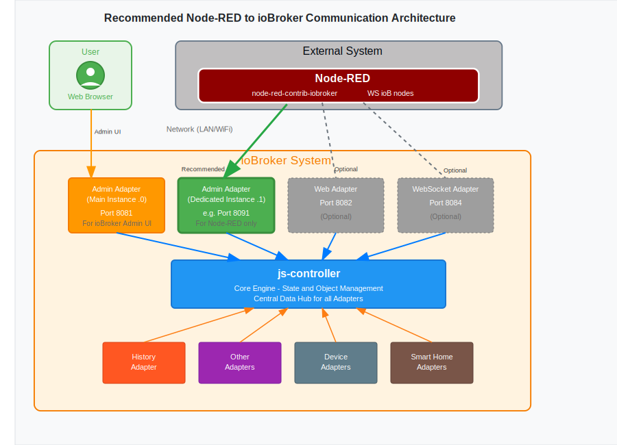

# Node-RED Nodes for ioBroker Integration

> **🌍 Languages:** [🇺🇸 English](#) | [🇩🇪 Deutsch](https://github.com/Marc-Berg/node-red-contrib-iobroker/blob/main/README.de.md)

External Node-RED integration nodes for ioBroker communication. **NOT an ioBroker adapter** - standalone package for external Node-RED instances to connect with ioBroker via WebSocket.

## 🤔 Which Solution is Right for You?

### 📊 Decision Guide: ioBroker Node-RED Adapter vs. These Nodes

| **Scenario** | **Use ioBroker Node-RED Adapter** | **Use These External Nodes** |
|:-------------|:---------------------------------:|:----------------------------:|
| **🏠 Simple Home Setup** | ✅ **Recommended** | ❌ Overkill |
| **🏭 Installation on Appliances/PLCs** | ❌ Not possible | ✅ **Recommended** |
| **⚡ High Performance Needs** | ❓ Shared resources | ⚠️ **May be beneficial** |
| **🔄 Node-RED Updates/Maintenance** | ❓ Tied to ioBroker | ✅ **Recommended** |
| **📊 Advanced Features** | ❓ Limited | ✅ **Recommended** |

### 🎯 **Use ioBroker Node-RED Adapter for:**
- **Simple home automation** with basic requirements
- **One-click installation** is priority
- **Minimal configuration** effort desired
- **Shared hosting** is acceptable

### 🚀 **Use These External Nodes for:**
- **Appliances and PLCs** (Wago, Beckhoff, etc.) with Node-RED
- **High-performance** applications (may benefit from dedicated resources)
- **Specialized features** like history data, logs
- **Latest Node-RED versions** immediately (no adapter dependency)
- **Full Node-RED configuration** access (all settings & modules)
- **Dedicated resources** and potential for better error isolation

## 🚀 Quick Start

### Installation
Install the nodes through the Node-RED Palette Manager:
1. Open Node-RED interface
2. Click on hamburger menu (three lines) → Manage palette
3. Go to "Install" tab
4. Search for "node-red-contrib-iobroker"
5. Click "Install" button

### Basic Setup
1. **Create dedicated Admin adapter instance** (recommended):
   - Install second Admin adapter instance in ioBroker
   - Configure on different port (e.g., 8091) 
   - Use exclusively for Node-RED connections
2. **Configure iob-config node** with your dedicated instance:
   - Host: hostname or IP address
   - Port: 8091 (your dedicated Admin instance)
   - Authentication: Optional username/password
3. **Use the nodes** in your flows

## 🏗️ Architecture Overview

The diagram shows the recommended architecture with a dedicated Admin adapter instance for Node-RED connections, separate from the main Admin interface used by regular users.

## 📦 Available Nodes

| Node | Purpose | Example Use | Documentation |
|------|---------|-------------|---------------|
| **WS ioB in** | Subscribe to state changes | Monitor temperature sensors  | [📖 Details](docs/nodes/iob-in.md) |
| **WS ioB out** | Send values to states with auto-creation | Control lights, switches |[📖 Details](docs/nodes/iob-out.md) |
| **WS ioB get** | Read current state values | Get sensor readings on demand |  [📖 Details](docs/nodes/iob-get.md) |
| **WS ioB getObj** | Retrieve object definitions with enum assignments | Access device metadata with room/function info | [📖 Details](docs/nodes/iob-getobject.md) |
| **WS ioB inObj** | Monitor object changes | Track adapter installations | [📖 Details](docs/nodes/iob-inobj.md) |
| **WS ioB history** | Access historical data | Energy consumption analysis | [📖 Details](docs/nodes/iob-history.md) |
| **WS ioB log** | Live log monitoring | System health monitoring | [📖 Details](docs/nodes/iob-log.md) |
| **WS ioB sendTo** | Send commands to ioBroker adapters | Telegram notifications, database queries | [📖 Details](docs/nodes/iob-sendto.md) |

## 🔧 Configuration

### Recommended Setup: Dedicated Admin Instance

**Why use a dedicated Admin instance?**
- Isolates Node-RED traffic from main admin interface
- Prevents conflicts with regular admin usage
- Avoids duplicate events when the Admin interface is open in browser
- Allows custom security settings

**Setup Steps:**
1. **Install second Admin adapter instance** in ioBroker:
   - Go to Adapters → Admin → Add Instance
   - Configure custom port (e.g., 8091)
   - Enable/disable features as needed
2. **Configure security** for Node-RED access:
   - Create dedicated user for Node-RED
   - Set appropriate permissions
   - Configure session duration ≥3600 seconds

### Server Configuration (iob-config)

**Connection Settings:**
- **Name**: Descriptive name for your ioBroker instance
- **Host**: IP address (e.g., 192.168.1.100) or hostname (e.g., iobroker.local)
- **Port**: Your dedicated Admin instance port (e.g., 8091)
- **Use SSL**: Enable for HTTPS/WSS connections

**Authentication Settings:**
- **No Authentication** (default): Leave username/password empty
- **OAuth2**: Enter valid ioBroker username/password

### Alternative Adapter Options

If you prefer not to use a Admin instance:

- **WebSocket adapter** (port 8084) - WebSocket adapter for external connections
- **Web adapter** (port 8082) - Requires "Use pure web-sockets" option enabled

**⚠️ Important Limitations with Alternative Adapters:**
- **WS ioB log node does not work** with WebSocket or Web adapter (requires Admin adapter)

## ⚠️ Important Notes

🔧 **Known Issue - Authentication Token Expiry**: There is currently a known issue with authentication and expiring tokens that can cause connection drops. **Do not use login session durations shorter than 3600 seconds** (1 hour) in your ioBroker adapter settings!

## 📚 Additional Resources

- **📋 Release Notes**: [Changelog](https://github.com/Marc-Berg/node-red-contrib-iobroker/blob/main/CHANGELOG.md)
- **🔍 Troubleshooting**: [Troubleshooting Guide](https://github.com/Marc-Berg/node-red-contrib-iobroker/blob/main/docs/troubleshooting.md)
- **📊 Logging**: [Logging Guide](https://github.com/Marc-Berg/node-red-contrib-iobroker/blob/main/docs/logging.md) - Understanding log messages and troubleshooting
- **🎯 Use Cases**: [Common Use Cases](https://github.com/Marc-Berg/node-red-contrib-iobroker/blob/main/docs/use-cases.md)
- **📖 Full Documentation**: [GitHub Repository](https://github.com/Marc-Berg/node-red-contrib-iobroker)
- **🐛 Bug Reports**: [GitHub Issues](https://github.com/Marc-Berg/node-red-contrib-iobroker/issues)
- **📘 ioBroker Forum**: [ioBroker.net](https://forum.iobroker.net)

## 📄 License

MIT

---
